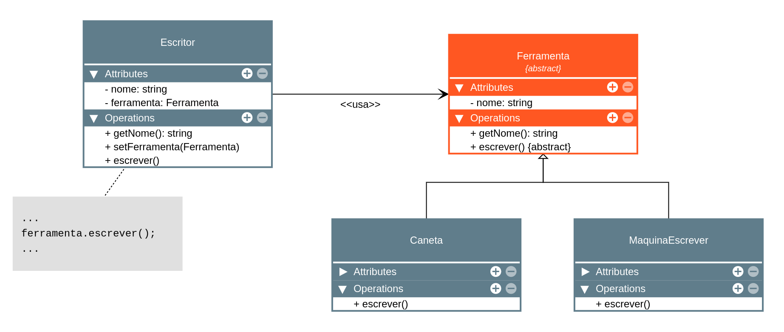

# Section 20 - Udemy JavaScript and TypeScript

---

# TypeScript - Classes e Interfaces - POO

- Classes
- Herança e Polimorfismo
- Super Classes
- Protected
- Getter e Setter
- Constructor Private
- Abstração
- Associação de classes
